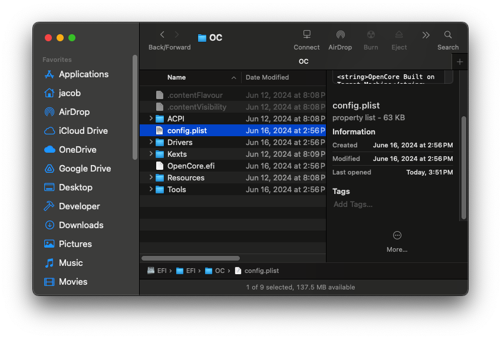
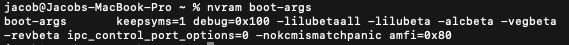
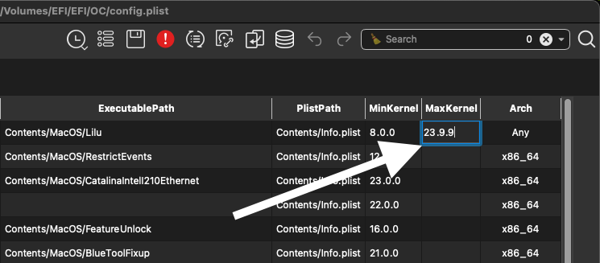
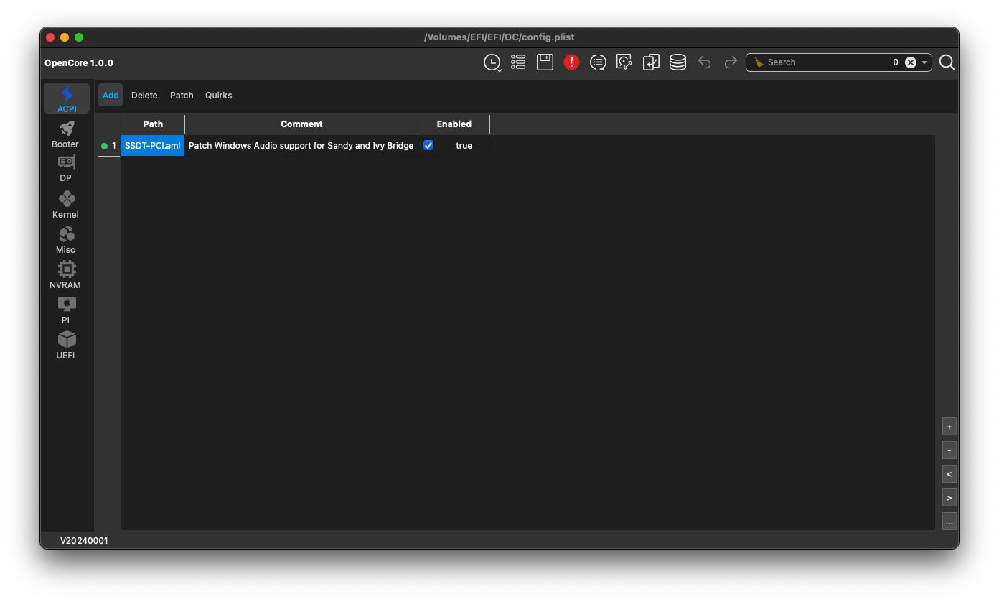
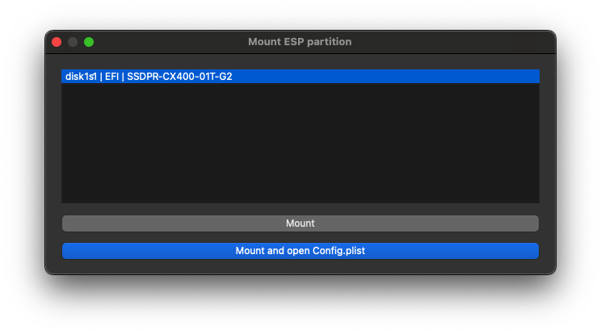
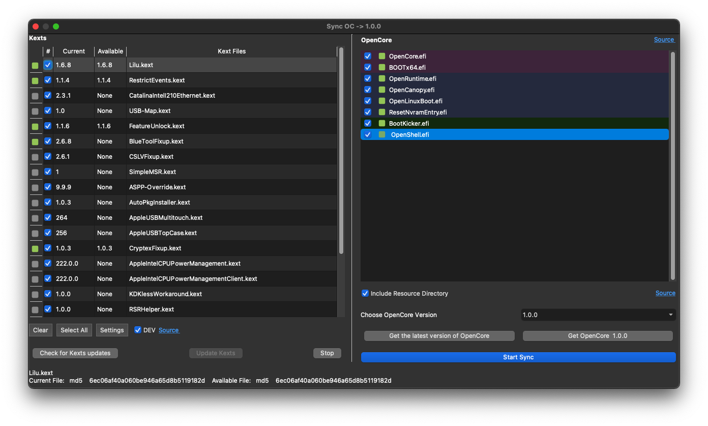

# macOS beta on unsupported Macs

Tutorial on booting the newest macOS beta on unsupported Macs without OCLP's support

## Introduction
<p>New versions of macOS are announced in June and Apple on the day of WWDC after the conference releases a macOS beta installer and the final release of the new macOS version in the fall.</p>
<p>Support for macOS 11 and newer for unsupported Macs is provided by Open Core Legacy Patcher that does not immediately support the new macOS version - there is a lot of work to do to achieve full support.</p>

> Bear in mind the tutorial is meant to help you be able to only boot the beta release, it will not help you apply root patches.

## List of contents
- [macOS Sonoma 14 beta](#macos-sonoma-14-beta)
- [macOS Sequoia 15 beta](#macos-sequoia-15-beta)
- [OCAuxiliaryTools](#ocauxiliarytools)
    <!-- [OpenCore-Patcher](#opencore-patcher)-->
- [Additional information](#additional-information)

## Warning
I am **not** responsible for any made modifications; **you** make them at **your** own risk.<br />
Before you start modifying the OpenCore bootloader, make sure to have a copy of it on an external drive or another EFI partition on the same disk drive.<br />
It is **never** a good idea to upgrade macOS, which you use on a daily basis, to the beta release, hence you should install macOS beta either on another partition, an external drive or another Mac.<br />
If your Mac is running patched macOS, there **should** be the latest natively supported macOS version installed on it (it can be installed on an external drive).

## Checklist
- [x] I read [warnings](#warning).
- [x] I am aware of the consenquences of making modifications that might occur.
- [x] I have macOS beta installed either on a seperate partition, an external disk drive, or another Mac.
- [x] I have access to the latest natively supported macOS version installed on my Mac I am about to make the modifications on. 

## Instruction
### macOS Sonoma 14 beta
1. Update OpenCore and kexts to ensure macOS beta will run.
    - Go to [OCAuxiliaryTools](#ocauxiliarytools) (do not close this app; you will use it later).
    
> [!NOTE]
> Before attempting to modify the file, it is recommended to create a copy of it and name the copy e.g. ```oldconfig.plist```

2. Open config.plist
    - macOS: /Volumes/EFI/EFI/OC/config.plist
    - Windows: X:\EFI\EFI\OC\config.plist
        

> [!IMPORTANT]
> The letter of mount point on Windows may be different for you!

3. Find ```boot-args``` and add the boot arguments below between ```<string></string>```:

    ```
    amfi=0x80 -lilubeta -lilubetaall -alcbeta -revbeta -vegbeta
    ```

    - The boot arguments should look like this more or less:
        
    - Boot arguments such as ```-lilubeta -alcbeta -revbeta -vegbeta``` may be unnecessary, but only ```-lilubetall``` may be required (and the rest of the boot arguments already existing).

> [!TIP]
> To find ```boot-args``` quickly, press on your keyboard Cmd ⌘/Ctrl + F and type it in.
4. Save the file.
5. Open OCAuxiliaryTools.
6. Go to **Kernel** (on the left).
7. Double-click **MaxKernel** in 
    - Lilu.kext and type ```23.9.9```
    - RestrictEvents.kext and type ```23.9.9```
    - AirPortBrcmFixup.kext and type ```22.99.99```
    - AirPortBrcmFixup.kext/Contents/Plugins/AirPortBrcmNic_Injector.kext and type ```22.99.99```
    - FeatureUnlock.kext and type ```23.9.9```
    - CryptexFixup.kext and type ```23.9.9```
    <br>
    

8. Press Enter, save changes (Cmd ⌘/Ctrl + S or the diskette icon on the top).
9. You can now try to boot macOS Sonoma beta!

<hr>

### macOS Sequoia 15 beta

In this case, it is much easier to boot Sequoia beta.

1. Update OpenCore and kexts to ensure macOS beta will run.
    - Go to [OCAuxiliaryTools](#ocauxiliarytools) (do not close this app; you will use it later).

> [!NOTE]
> Before attempting to modify the file, it is recommended to create a copy of it and name the copy e.g. ```oldconfig.plist```

2. Open config.plist
    - macOS: /Volumes/EFI/EFI/OC/config.plist
    - Windows: X:\EFI\EFI\OC\config.plist
    

> [!IMPORTANT]
> The letter of mount point on Windows may be different for you!

3. Find ```boot-args``` and add the boot arguments below between ```<string></string>```:
    ```
    amfi=0x80 -lilubetaall
    ```

    - The boot arguments should look like this more or less:
        

    - The argument ```amfi=0x80``` might not be required, however, if you plan to make some modifications in macOS Sequoia beta, AMFI should be disabled.

> [!TIP]
> To find ```boot-args``` quickly, press on your keyboard Cmd ⌘/Ctrl + F and type it in.

4. Save the file.
5. You can now try to boot macOS Sequoia beta!
    - Editing **MaxKernel** values, as with Sonoma beta, is not necessary; do not change anything, unless you know what to do if something goes wrong.

<hr>

### OCAuxiliaryTools
1. Download OCAuxiliaryTools from <a href="https://github.com/ic005k/OCAuxiliaryTools">here</a>.
    
2. Open it and press Cmd ⌘/Ctrl + M
3. Select the EFI partition and type your password if prompted
    
4. Press Cmd ⌘/Ctrl + 6 or click Edit → Upgrade OpenCore and Kexts
5. Click "Start Sync" and later "Check for Kexts updates" and "Update Kexts".
    
6. The end!

<hr>

### Additional information
- **Cmd ⌘** - if you have an Apple keyboard or other keyboard that has the Command logo on a key
- **Ctrl** - if you do not have an Apple keyboard and there is no Command logo on any key
- OCAuxiliaryTools actually lets you modify boot arguments, which means you do not have to open the file and edit it manually; a tutorial soon.

<br>